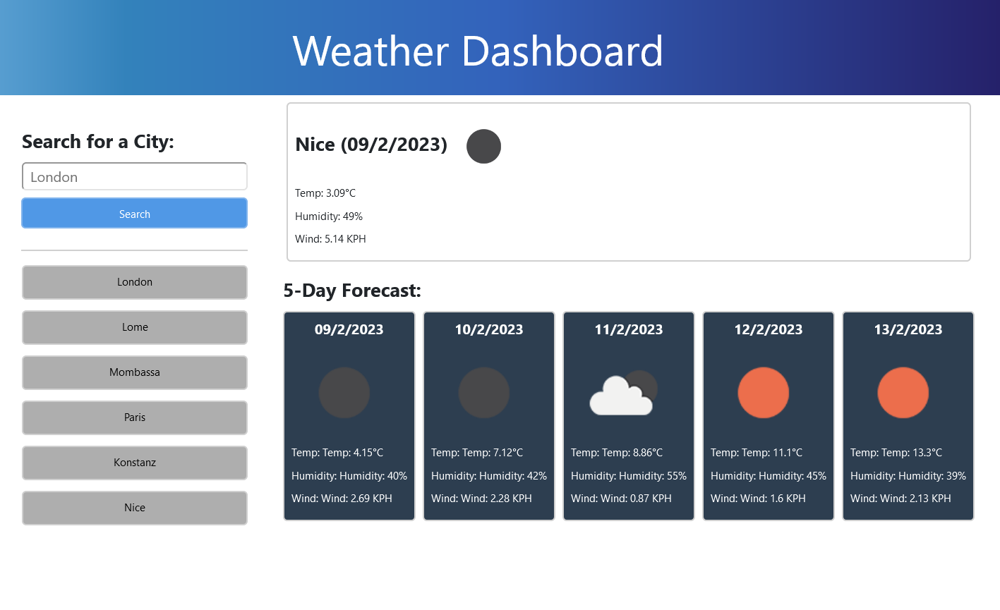

# WEATHER DASHBOARD


## 🚩 TABLE OF CONTENT

- [Description](#-description)
- [Usage](#-usage)
- [Technology used](#-technology-used)
- [Installation](#-installation)
- [Credits](#-credits)

## 📖 DESCRIPTION

### 🎯 What is it about?

- Using the APIs provided by Open Weather, I built a weather dashboard that runs in the browser and features dynamically updated HTML and CSS powered by JavaScript.
- The weather for the current and the next five days is displayed based on the geolocation of the city provided by the user in the input field.

### Preview

The following image shows the web application's appearance and functionality:



## 💻 USAGE

[You can visit the webpage here](https://senseilein.github.io/weather-dashboard)

### 💬 User story

```
As a user,
I WANT to use the app,
SO THAT I can see the weather in the city of my choice
```

```
GIVEN the weather dashboard application

WHEN I input a city name and click on the search button,
THEN I can see the current weather and the weather for the next 5 days in that city

WHEN I come back to the webpage,
THEN I can see the last 6 cities that I've looked up

```

### ✅ Acceptance Criteria

It's done when:

- [ ] After pressing the search button, the user can see additional content generated based on the inputted city name
- [ ] For each city, a new button is generated so that the user can retrieve weather info for that city by clicking directly on that button (without having to type the name of the city again)
- [ ] For each day, we can see the date - temperature - humidity level - wind speed and icon illustrating the weather condition.

## 🔧 TECHNOLOGY USED

- [ ] HTML, CSS & Bootstrap Framework
- [ ] JavaScript and jQuery Library
- [ ] Open Weather Geocoding API to convert city names to geo coordinates needed for the second API
- [ ] Open Weather Current Weather API to access current weather data for any location on Earth including over 200,000 cities
- [ ] Open Weather 5 Day Weather Forecast API (including weather forecast data with 3-hour step)

### 💡 What I've learnt

- Reading API documentation
- Using the ajax() method to exchange data with a server, and update parts of the web page - without reloading the whole page.
- Using Local Storage to store persistent data

### ➕ Suggestions for improvement

- Add an input field to specify the country (in cas two cities have the same name)
- Display the information in the user language (or using navigator.language)

## 🚀 INSTALLATION

No installation needed however to use the APIs mentioned above as a developer, it is necessary to sign up and request an API key on the [Open Weather website](https://openweathermap.org/api).

## 💬 CREDITS

- This project was created as part of a coding assignment with [Trilogy Education Services](https://skillsforlife.edx.org/?utm_source=govuk)
- Thanks to my tutors - Tudor for explaining how localStorage works and Abdulraghman for his clear explanations about the ajax method.
- Special thank to my tutor Clobee for helping me debug my code.
